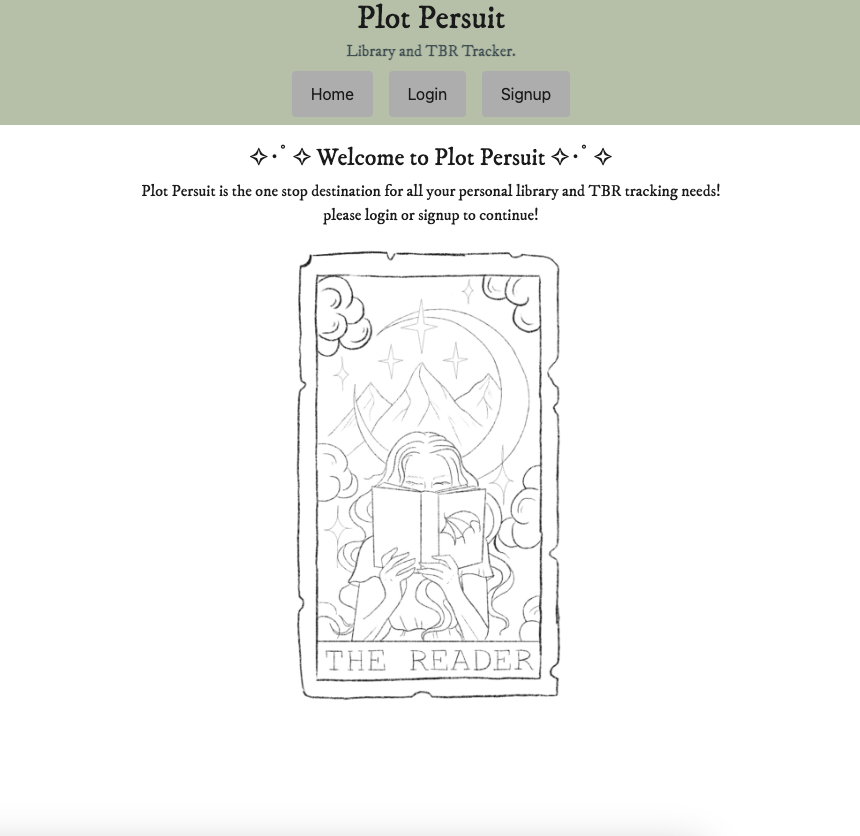
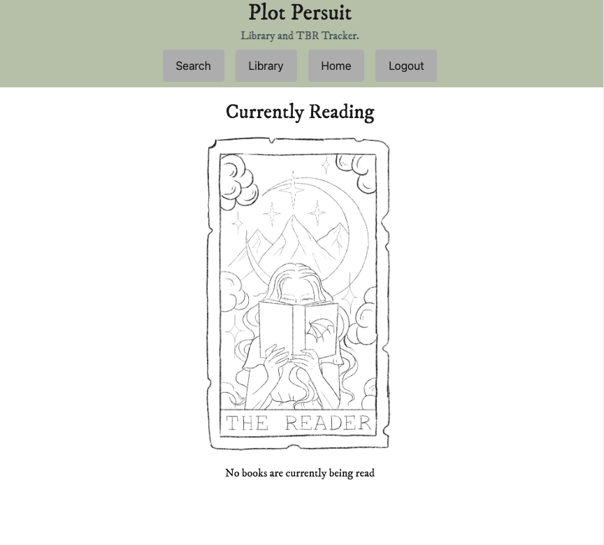
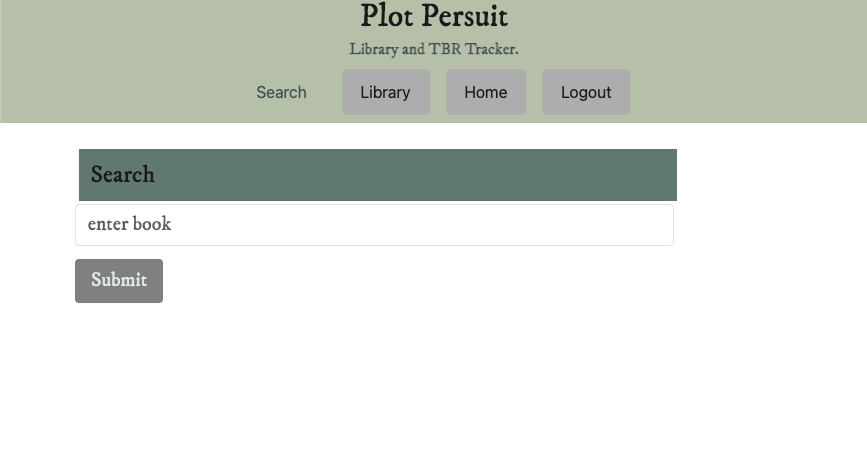
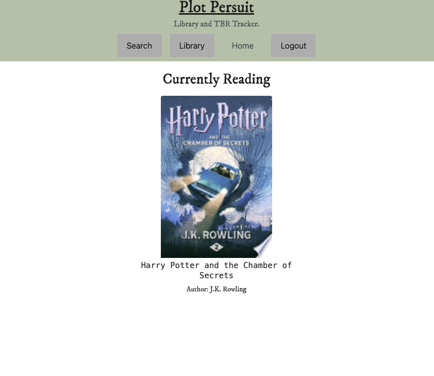
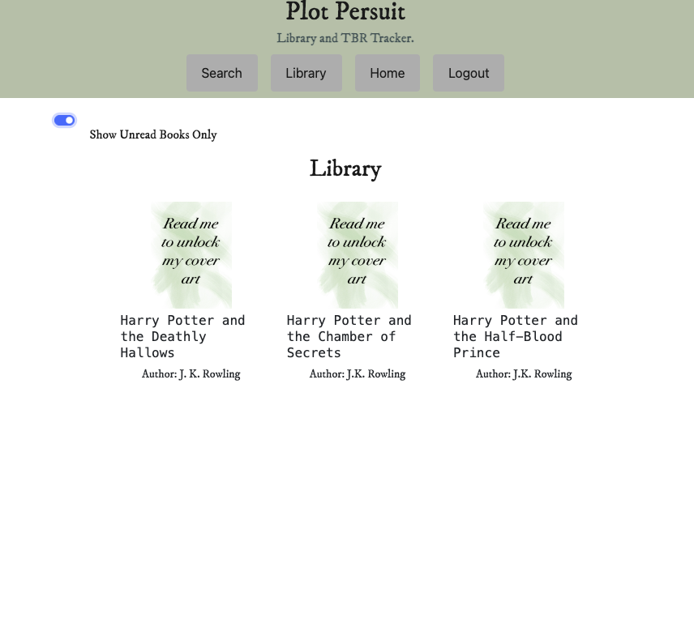

# Plot-Pursuit

## Table of Contents

- [Description](#description)
- [Screenshots](#screenshots)
- [Live Site](#live-site)
- [Technologies Used](#technologies-used)
- [Installation](#installation)
- [Features](#features)
- [Questions](#questions)

## Description

Introducing Plot Pursuit, the ultimate tool for book enthusiasts to manage their 'To Be Read' (TBR) lists with ease! Plot Pursuit is a comprehensive application designed to empower users in curating and organizing their personal libraries. With Plot Pursuit, users can create a digital library of their unread books, allowing them to efficiently track which books they have yet to read.

One of the standout features of Plot Pursuit is its ability to update the status of books as 'read' once the user has finished reading them. This feature not only helps users keep track of their reading accomplishments but also ensures that their library remains up to date.

Whether you're an avid reader looking to organize your extensive book collection or a casual reader aiming to stay on top of your reading list, Plot Pursuit is the perfect companion for bibliophiles of all kinds. Say goodbye to scattered TBR lists and hello to a streamlined reading experience with Plot Pursuit!

## Screenshots

## Live Site

https://plot-pursuit.onrender.com/

## Technologies Used

- React
- GraphQL
- Node.js
- Express.js
- MongoDB
- Google Books API

## Features

- Search and add books to personal library
- Check off if the book has been read or if you are currently reading it
- Display full library or unread books only
- Homepage displays currently read books
- Unlock book voer in library only after its been read

## Installation

1. Begin by cloning the repository using the command git clone https:/assets/github.com/assets/Conartisttt/assets/Plot-Pursuit.git.
2. Open the cloned project in Visual Studio Code. If you don't have it installed, make sure to install it first.
3. Install Node.js version 16 using the terminal.
4. After installing Node.js, initialize a new package.json file by running the command npm init -y in the terminal.
5. Install the required dependencies for the application by running npm i in the terminal.
6. Ensure you have MongoDB access by having an account and installing MongoDB Compass, which allows you to interact with the database visually.
7. Once all dependencies are installed, open a new terminal in the project's root directory and execute the following commands: npm run seed to seed the database, npm run build to build the application (this also helps to identify any build errors), and npm run develop to start the application, which will open it in a new tab in your default browser.
8. Enjoy working on building your library

## Questions

Have any questions, or would like to discuss this project with the creators? [Conner's Github](https:/assets/github.com/assets/Conartisttt) ⋆ ˚｡⋆୨♡୧⋆ ˚｡⋆ [Daelyn's Github](https:/assets/github.com/assets/dhiduchick) ⋆ ˚｡⋆୨♡୧⋆ ˚｡⋆ [Ay's Github](https:/assets/github.com/assets/shinayomi1)
